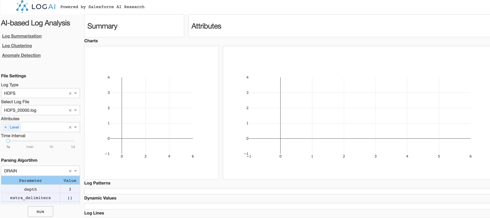
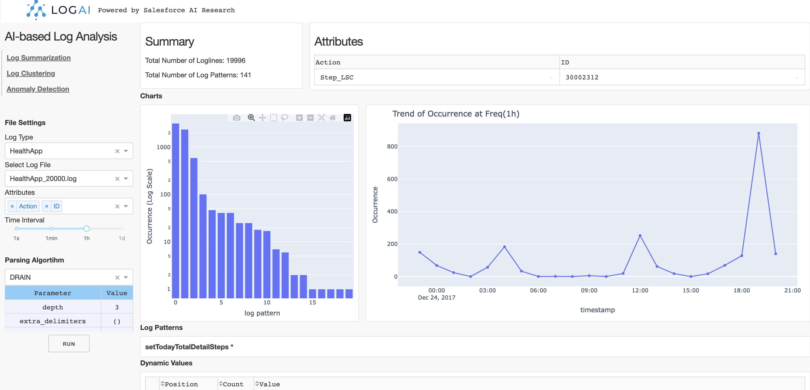
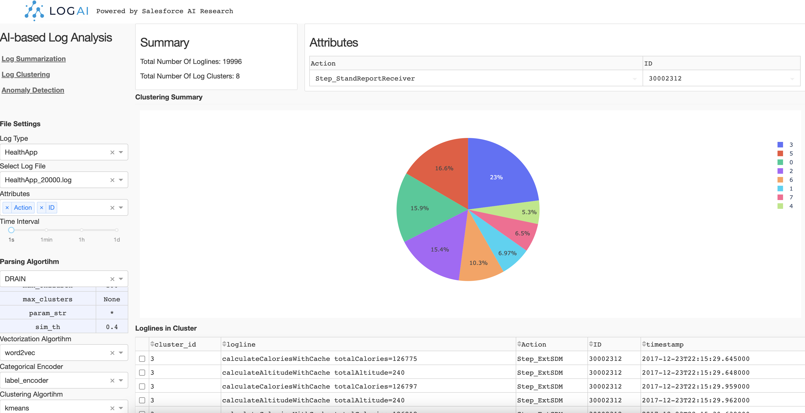
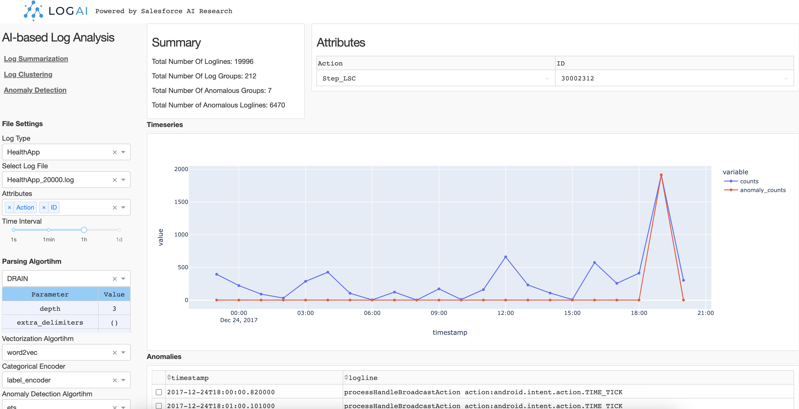

<!--
Copyright (c) 2023 Salesforce.com, inc.
All rights reserved.
SPDX-License-Identifier: BSD-3-Clause
For full license text, see the LICENSE file in the repo root or https://opensource.org/licenses/BSD-3-Clause

-->

<p align="center">
    <br>
    
    </br>
</p>


<div align="center">
  <a href="https://github.com/DatadudeDev/logmatic/actions/workflows/docker-image.yml">
    
  </a>
  <a href="https://github.com/datadudedev/logmatic/releases/tag/1.0">
    
  </a>
  <a href="https://badge.fury.io/py/Logmatic">
    
  </a>
  <a href="https://opensource.org/licenses/BSD-3-Clause">
    
  </a>
</div>

# Logmatic: A Library for Log Analytics and Intelligence

## Table of Contents
* [Introduction](#introduction)
* [Installation](#installation)
* [Getting Started](#getting-started)
  * [Explore Logmatic GUI Portal](#explore-Logmatic-gui-portal)
  * [Run Simple Time-series Anomaly Detection Application](#run-simple-time-series-anomaly-detection-application)
  * [Build Customized Logmatic Applications](#build-customized-Logmatic-applications)
  * [Deep-learning Anomaly Detection Benchmarking](#deep-learning-anomaly-detection-benchmarking)
* [Documentation](#documentation)
* [Technical Report and Citing Logmatic](#technical-report-and-citing-Logmatic)

## Introduction
Logmatic is a one-stop open source library for log analytics and intelligence. Logmatic supports various log analytics and log intelligence tasks such as log summarization, log clustering, log anomaly detection and more. It adopts the OpenTelemetry data model, to enable compatibility with different log management platforms. Logmatic provides a unified model interface and integrates popular time-series, statistical learning and deep 
learning models. Alongside this, Logmatic also provides an out-of-the-box GUI toolkit for users to conduct interactive log 
analysis. With Logmatic, we can also easily benchmark popular ML and deep-learning algorithms for log anomaly detection 
without putting in redundant effort to process the logs. We have opensourced Logmatic to facilitate a wide range of 
applications benefiting both academic research and industrial prototyping. 
 
The following table compares Logmatic with several existing log analysis Tools, include both commercial log management platforms
like NewRelic and DataDog, or popular log analysis open source tools on Github. 

| Coverage  | Logmatic | NewRelic Log Monitoring | DataDog Log Explorer | logparser | loglizer | deep-loglizer | log3C | 
| ------------- | ------------- | ------------- |  ------------- | ------------- | ------------- | ------------- | ------------- |
| OpenTelemetry log data model  | :white_check_mark:  | :white_check_mark:  | :white_check_mark:  | | | | | | 
| Unified data loader and preprocessing | :white_check_mark:  | :white_check_mark:  | :white_check_mark:  | :white_check_mark:  | :white_check_mark:  | :white_check_mark: | |
| Auto log parsing  | :white_check_mark:  | :white_check_mark: | :white_check_mark: | | | 
| Log clustering | :white_check_mark: | :white_check_mark:  | :white_check_mark:  | | | | :white_check_mark: | 
| Log anomaly detection - time-series | :white_check_mark: | :white_check_mark:  | :white_check_mark:  | | | | | | 
| Log anomaly detection - traditional ML | :white_check_mark: |  |  | | :white_check_mark: |  |  |  
| Log anomaly detection - deep Learning | :white_check_mark: |  | | | :white_check_mark: | :white_check_mark: |  |  
| Huggingface integration | :white_check_mark: | | | | | |  |
| GUI for result visualization | :white_check_mark: | :white_check_mark: | :white_check_mark: | | | | |

## Installation

### Quick Install
You can install logmatic using the Docker image: 

```
docker run -d -p 8050:8050 --name logmatic docker.io/datadudedev/logmatic:latest

```


If you prefer Docker Compose: 

```
version: '3.8'

services:
  logai:
    image: docker.io/datadudedev/logai:latest
    container_name: logai_container
    ports:
      - "8050:8050"
```



The control panel is on the left side of the page. There are three applications you can choose from:
Log Summarization, Log Clustering and Anomaly Detection.

#### Control Panel

**File Setting**. You can select the log type and log files to be processed. Now Logmatic supports three 
public datasets: HDFS, BGL and HealthApp. For each log type we included several sample log data. After
log file selected, you can choose the attributes you want to be involved in log processing. The selected 
attributes will be treated as structured log attributes.

**Algorithm Setting**. For different applications, the algorithms options may be different.
For example, auto-log parsing algorithms are utilized for log summarization, but log clustering uses auto-parsing algorithms,
 vectorization algorithms, categorical encoding and clustering algorithms. You can select an
 algorithm and change the parameters in each algorithm section. After algorithm configuration, simply click "run" to
run the application.

#### Log Summarization

Log summarization App summarize and group the raw logs by log patterns and attributes. You can click on 
each log pattern and see what the pattern looks like and the dynamic values in each position. You can also 
see the chart of occurrance trend of this pattern on the right side.



#### Log Clustering

Log clustering App groups raw logs into clusters by calculating the semantic representation of each logline. 
Then using clustering algorithms to generate log clusters. In this example, we choose k-mean where `k==8` to
generate 8 clusters. The result is shown as a pie chart and you can click each portion of the pie chart to check
the raw logs in this cluster.



#### Anomaly Detection

Log anomaly detection App conduct log anomaly detection tasks. Similar to log clustering, log anomaly detection
also needs to extract information from raw logs and generate representation of loglines. Depend on the type of anomaly detection,
The representation can be different. 
**Time-series anomaly detection**. If we use time-series algorithm like ETS, the raw logs will be converted
into log counter vectors by given time interval. Then ETS is performed on the generated log counter vectors and detect
anomalous timestamps on the counter vector time-series. 

**Semantic anomaly detection**. If we use unsupervised outlier detection algorithms such as One-class SVM, the raw logs will 
be converted into semantic vectors and feed the One-class SVM model. Then the model will detect anomalous loglines.



Logmatic GUI portal is just an example to demo Logmatic capabilities. We know this may not be the best way to visualize the 
results and there might be bugs in how the results are displayed. We will keep working with the open source community
to improve usability of the portal. Any feedbacks and contributions are welcome :blush:. 

### Run Simple Time-series Anomaly Detection Application

You can also use Logmatic in more programtic ways. Logmatic supports configuration files in `.json` or `.yaml`. 
Below is a sample `log_anomaly_detection_config.json` configuration for anomaly detection application. 
Make sure to set `filepath` to the target log dataset file path.

```json
{
      "open_set_data_loader_config": {
        "dataset_name": "HDFS",
        "filepath": ""
      },
      "preprocessor_config": {
          "custom_delimiters_regex":[]
      },
      "log_parser_config": {
        "parsing_algorithm": "drain",
        "parsing_algo_params": {
          "sim_th": 0.5,
          "depth": 5
        }
      },
      "feature_extractor_config": {
          "group_by_category": ["Level"],
          "group_by_time": "1s"
      },
      "log_vectorizer_config": {
          "algo_name": "word2vec"
      },
      "categorical_encoder_config": {
          "name": "label_encoder"
      },
      "anomaly_detection_config": {
          "algo_name": "one_class_svm"
      }
    }
```

Then to run log anomaly detection. You can simply create below python script:

```python
import json

from Logmatic.applications.application_interfaces import WorkFlowConfig
from Logmatic.applications.log_anomaly_detection import LogAnomalyDetection

# path to json configuration file
json_config = "./log_anomaly_detection_config.json"

# Create log anomaly detection application workflow configuration
config = json.loads(json_config)
workflow_config = WorkFlowConfig.from_dict(config) 

# Create LogAnomalyDetection Application for given workflow_config
app = LogAnomalyDetection(workflow_config)

# Execute App
app.execute()

```

Then you can check anomaly detection results by calling `app.anomaly_results`. 

For full context of this example please check
[Tutorial: Use Log Anomaly Detection Application](./examples/jupyter_notebook/log_anomaly_detection_example.ipynb).

### Build Customized Logmatic Applications
You can build your own customized log analysis applications using Logmatic. Here we show two examples:

* [Tutorial: Log Clustering Using Logmatic](./examples/jupyter_notebook/tutorial_log_clustering.ipynb)
* [Tutorial: Log Anomaly Detection Using Logmatic](./examples/jupyter_notebook/tutorial_log_anomaly_detection.ipynb)

### Deep-learning Anomaly Detection Benchmarking

Logmatic can be used to benchmark deep-learning anomaly detection results. 
A [tutorial](examples/jupyter_notebook/tutorial_deep_ad.md) is provided for 
Anomaly Detection Benchmarking using LSTM anomaly detector for HDFS Dataset. More examples of deep-learning anomaly 
detection benchmarking on different datasets and algorithms can be found in 
[Deep Anomaly Detection Benchmarking Examples](examples/jupyter_notebook/nn_ad_benchmarking).


